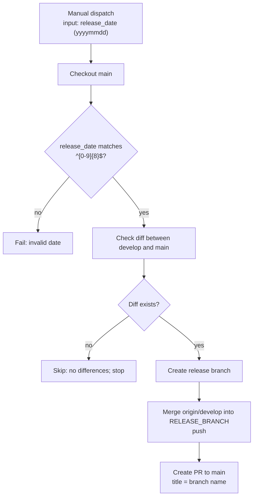

# Manual Trigger Workflow

Flow for `.github/workflows/manual-trigger.yaml`:

```mermaid
flowchart TD
  A["Manual dispatch<br/>input: release_date (yyyymmdd)"] --> B["Checkout main"]
  B --> C{"release_date matches<br/>^[0-9]{8}$?"}
  C -- no --> F["Fail: invalid date"]
  C -- yes --> D["Check diff between develop and main"]
  D --> E{"Diff exists?"}
  E -- no --> J["Skip: no differences; stop"]
  E -- yes --> K["Create release branch"]
  K --> M["Merge origin/develop into RELEASE_BRANCH<br/>push"]
  M --> O["Create PR to main<br/>title = branch name"]
```
